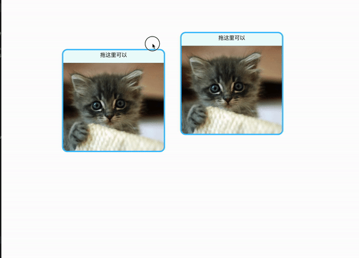

# react-draggable 中文教程

首发于：[卡拉云技术博客](https://kalacloud.com/blog/react-draggable-tutorial/)

在实现[卡拉云](/blog)时，我们也大量使用了 `react-draggable`。所以这篇文章里，我们介绍如何使用 react-draggable，一些常见的设置和我们的经验。请根据下面的代码一步步实现，最终你要实现的效果如下

